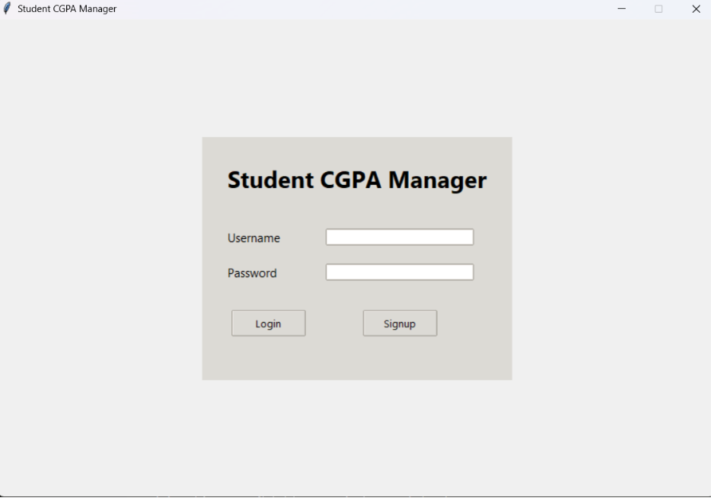
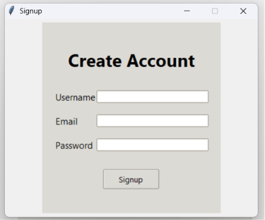
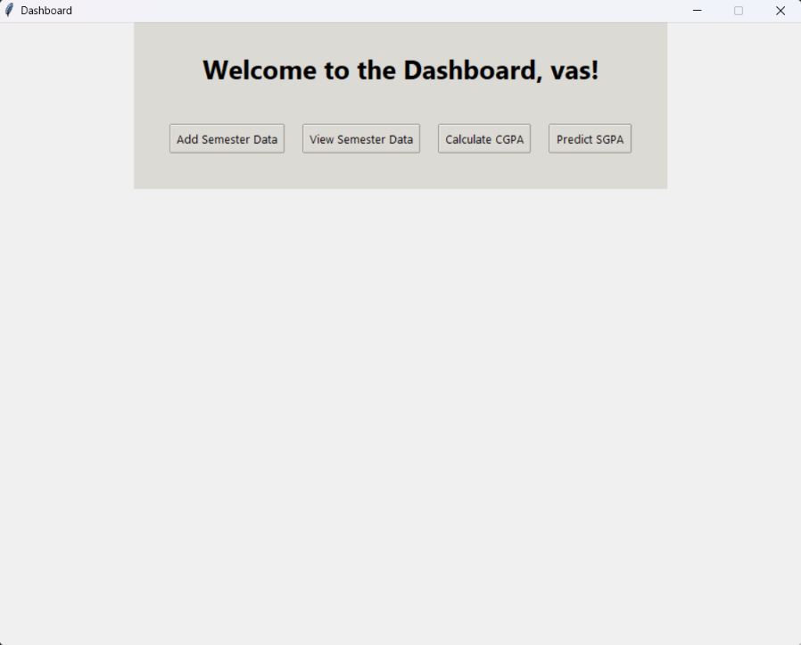
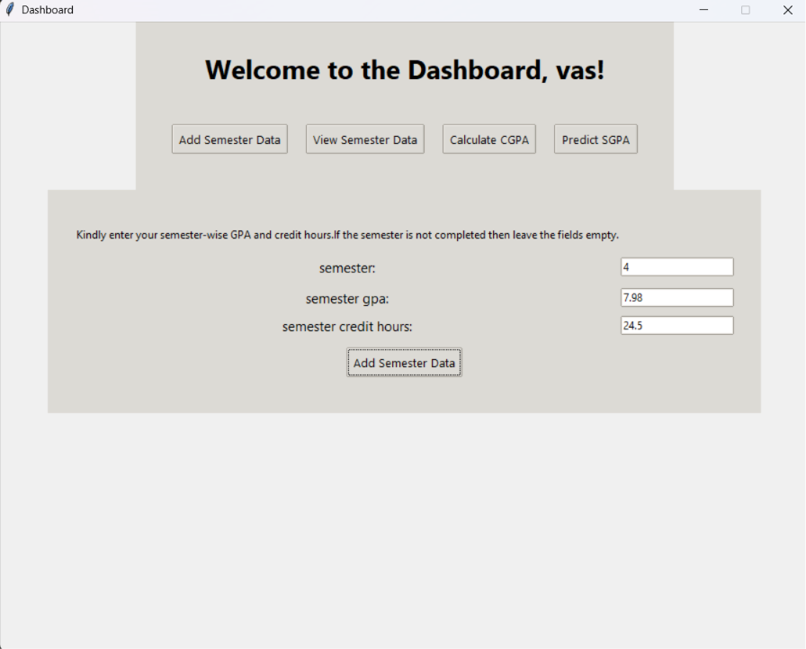
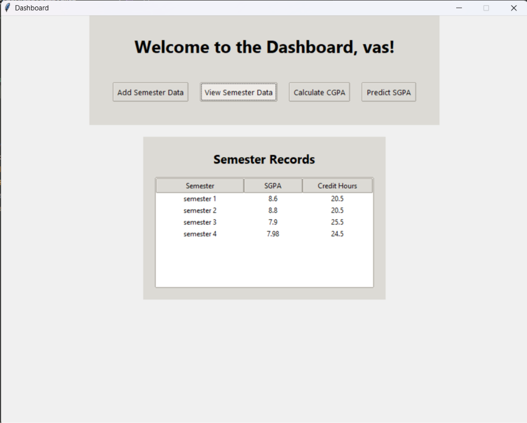
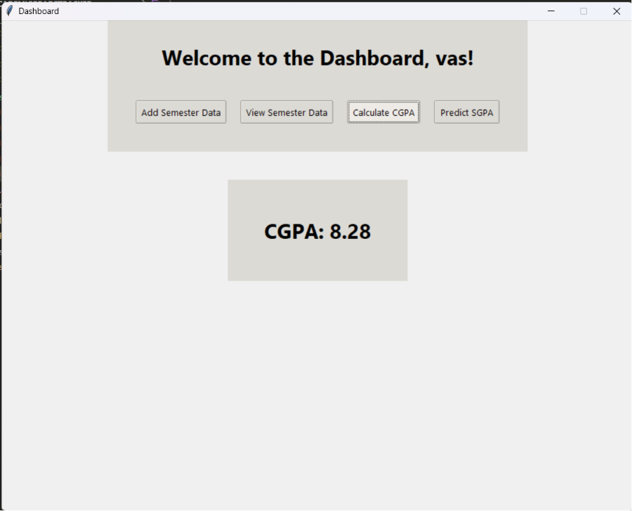
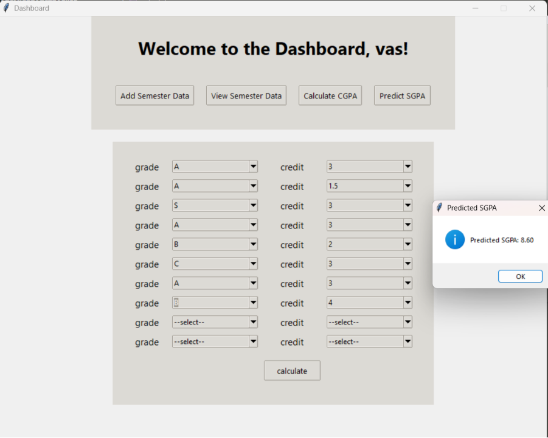

# AcademicGradeTracker
python based academic tracker with login page, semester recoder, and sgpa/cgpa calculation

## Features
- User login and SignUp
- Secure credential validation
- Add semester-wise GPA and credit hours
- View all recorded semester data
- Calculate cumulative CGPA
- Predict SGPA based on subject grades and credits
- JSON-based data storage
- Simple and user-friendly Tkinter interface

## Technologies Used
- Python
- Tkinter
- ttk
- JSON
- Regular Expressions (re)

## Project sturcture

AcademicGradeTracker/
|-- login.py
│── storage.py
│── students.json
│── README.md

## How to Run

1. Clone the repository

```bash
git clone https://github.com/yourusername/AcademicGradeTracker.git
```

2. Move into the project directory

```bash
cd AcademicGradeTracker
```

3. Run the application

```bash
python login.py
```

## Future Improvements

- SQLite database support
- Password hashing
- Graphical CGPA analysis
- Export semester reports to PDF
- Dark mode

## Screenshots

### Login Page



### SignUp 



### Dashboard



### ADD SGPA



### Semester Data



### Calculate CGPA



### Predict SGPA



## Author

Kerthivasan